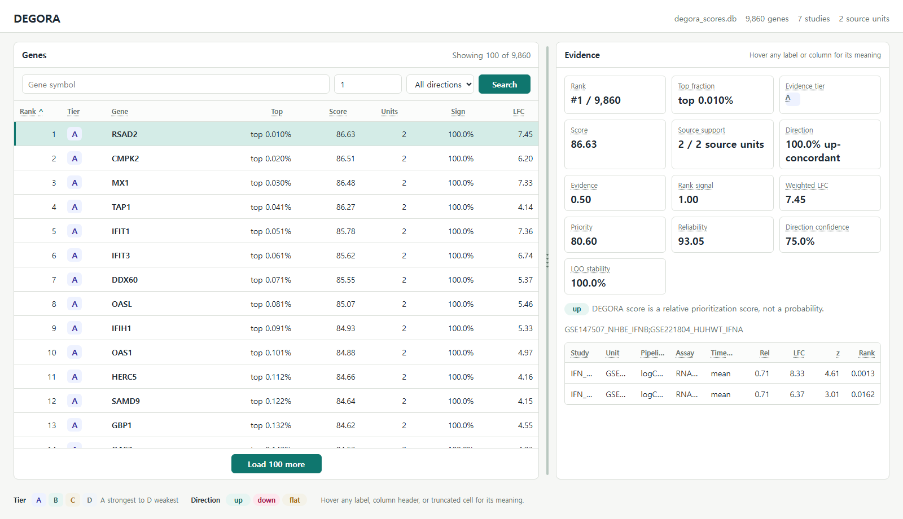

# DEGORA

DEGORA turns published differential-expression gene tables into a local,
source-traceable gene-evidence database and browser dashboard.

You can use DEGORA when you have DEG result tables from RNA-seq, microarray, or
similar transcriptomic studies and want one reproducible gene ranking plus the
per-study evidence behind each ranked gene.

DEGORA runs locally. The dashboard is opened in your browser, but your input
files are not uploaded to an external server.

## Dashboard Snapshot



## Quick Start for Beginners

This path does not require a GitHub account. You also do not need to know Git.

### 1. Install Python

Install Python before downloading DEGORA.

**Windows users:** use WSL Ubuntu, not native Windows PowerShell or Command
Prompt. In Windows Terminal, open Ubuntu and run:

```bash
sudo apt update
sudo apt install -y python3 python3-venv python3-pip curl unzip
```

**macOS users, including Apple Silicon M1/M2/M3/M4:** install Python 3 from
[python.org](https://www.python.org/downloads/macos/) or Homebrew. Then use the
Terminal app.

**Linux users:** install Python 3, `venv`, `pip`, `curl`, and `unzip` with your
system package manager.

Check that Python works:

```bash
python3 --version
```

DEGORA needs Python 3.10 or newer.

### 2. Download DEGORA Without Git

Run these commands in the folder where you want DEGORA to live:

```bash
curl -L -o DEGORA.zip https://github.com/kangk1204/DEGORA/archive/refs/heads/main.zip
python3 -m zipfile -e DEGORA.zip .
cd DEGORA-main
```

If you prefer clicking, open
[https://github.com/kangk1204/DEGORA](https://github.com/kangk1204/DEGORA),
choose **Code**, then **Download ZIP**. Unzip the file, open a terminal inside
the unzipped `DEGORA-main` folder, and continue below.

### 3. Install DEGORA and Run the Demo

Create a local Python environment:

```bash
python3 -m venv .venv
source .venv/bin/activate
python -m pip install --upgrade pip
python -m pip install -e outputs/code
```

Create and run the demo analysis:

```bash
degora demo degora-demo
degora validate degora-demo/degora_demo_config.xlsx
degora run degora-demo/degora_demo_config.xlsx
degora serve degora-demo/results/degora_scores.db
```

Open the URL printed by the last command, usually
[http://127.0.0.1:8765](http://127.0.0.1:8765).

### 4. Returning Later

If you close the terminal, DEGORA is still installed inside `.venv`; you only
need to return to the folder and reactivate it:

```bash
cd DEGORA-main
source .venv/bin/activate
degora serve degora-demo/results/degora_scores.db
```

If `degora` says `command not found`, you are probably outside the activated
environment. Run:

```bash
source .venv/bin/activate
```

## Quick Start with Git

If you already use Git, clone the repository instead of downloading the ZIP:

```bash
git clone https://github.com/kangk1204/DEGORA.git
cd DEGORA
python3 -m venv .venv
source .venv/bin/activate
python -m pip install --upgrade pip
python -m pip install -e outputs/code
```

Then run the same demo commands shown above.

## Analyze Your Own DEG Tables

First create an Excel template:

```bash
degora template DEGORA_template.xlsx
```

Open `DEGORA_template.xlsx` and fill the workbook. Lines that begin with `#`
inside the template are comments for humans; DEGORA ignores them during
analysis.

### Required Input Information

Each contrast must tell DEGORA where the DEG table is and which columns contain
the required values:

| Information | Meaning |
| --- | --- |
| Study or source ID | A stable name for the study, paper, dataset, or source unit |
| DEG table path | Path to the CSV, TSV, Excel, or Parquet file |
| Gene column | Column containing gene symbols |
| Effect column | Column containing log fold change or another signed effect |
| P-value column | Column containing raw p-values |

The required biological columns are:

| Required DEG column | Accepted meaning |
| --- | --- |
| `gene` | Gene symbol, such as `STAT1` |
| `effect` or `logFC` | Signed effect; positive and negative directions are preserved |
| `pvalue` | Raw p-value between 0 and 1 |

### Optional Input Information

These columns are useful when available, but DEGORA can run without them:

| Optional column | Use |
| --- | --- |
| `padj` | Adjusted p-value or FDR; must be between 0 and 1 if provided |
| `stat` | Test statistic from the original analysis |
| `n_case`, `n_control`, or sample count | Helps describe the source |
| `assay`, `platform`, `tissue`, `condition` | Helps label evidence in the dashboard |
| `source_url` | Link to the original data record or study |

Validate the workbook before running:

```bash
degora validate DEGORA_template.xlsx
```

Run the analysis:

```bash
degora run DEGORA_template.xlsx
```

The output folder contains:

| Output | Purpose |
| --- | --- |
| `degora_scores.db` | Local SQLite evidence database for the dashboard |
| `degora_gene_scores.csv` | Ranked gene table |
| `degora_gene_evidence.csv` | Per-gene, per-source evidence table |
| `.source` and `.provenance.json` files | Reproducibility sidecars |

Open the result dashboard:

```bash
degora serve results/degora_scores.db
```

Use the exact database path printed by `degora run` if your output folder has a
different name.

## Development Checks

For local testing:

```bash
python -m pip install -e "outputs/code[dev]"
make check
```

The public test suite checks the package, CLI, Excel template behavior,
harmonization, scoring, API, and dashboard-serving code.

## Notes

- Native Windows is not the supported path. Use WSL Ubuntu on Windows.
- macOS on Apple Silicon is supported through the standard Python environment
  shown above.
- DEGORA works from published DEG tables. It is not a replacement for raw
  expression reanalysis when raw matrices and phenotype metadata are available.
