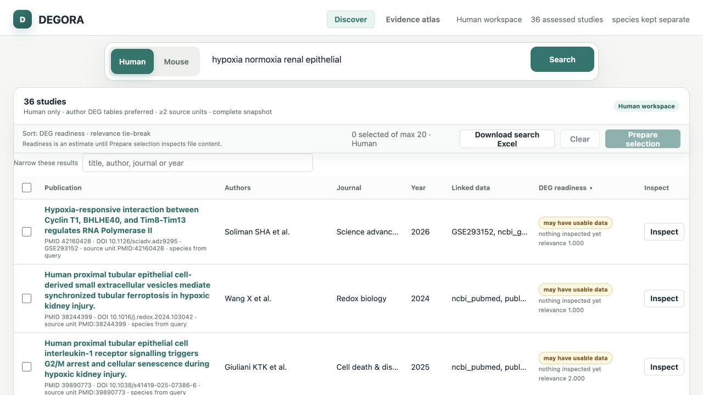
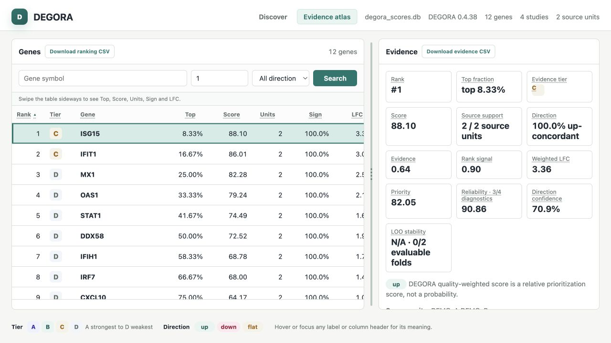

# DEGORA

DEGORA combines differential-expression result tables into a source-traceable gene ranking and a local browser dashboard. It accepts tabular results from RNA-seq, microarray, and related transcriptomic workflows.

The software can also search public Human or Mouse records, help you inspect available result tables or upstream matrices, and prepare a species-specific analysis. Human and Mouse records are always kept in separate workspaces and separate runs.

## Search and Evidence Atlas

### Search public records

Search Human or Mouse studies in separate workspaces, review linked records,
and inspect likely DEG inputs before preparation.



*Search results are illustrative and may change as public databases are updated.*

### Inspect ranked evidence

After a run, the Evidence Atlas displays the gene ranking together with the
source-resolved evidence for each gene.



*Evidence Atlas view of the bundled synthetic demo.*

## Quickstart

For a stable first run, use the tagged v0.4.38 release. The changes planned for
v0.4.39 remain on the development branch until release verification is complete:

```bash
git clone --depth 1 --branch v0.4.38 https://github.com/kangk1204/DEGORA.git
cd DEGORA
bash scripts/degora_quickstart.sh
```

The script selects a supported Python interpreter, creates an isolated
environment, installs DEGORA, builds the bundled synthetic demo, and opens the
local dashboard. Press `Ctrl+C` in the terminal to stop the server.

## Requirements

- Python 3.10 or newer; automated release tests cover Python 3.10-3.14, and Python 3.12 is recommended
- Ubuntu or macOS; Windows 11 users can run the same Linux workflow in WSL2 Ubuntu
- Internet access for cloning or downloading the repository and for installing
  or updating dependencies; after installation, the bundled synthetic demo runs
  offline. Public-data search and downloads also require Internet access
- Git, unless you use the ZIP download option below

Native Windows PowerShell is not the supported full-workflow environment. On Windows 11, install WSL2 once from an administrator terminal:

```powershell
wsl --install
```

Restart if requested, open Ubuntu, and use the Linux commands below.
The automated release matrix tests native Ubuntu and macOS. WSL2 uses the Ubuntu workflow, but this release is not separately exercised on a hosted Windows runner.

## Install

With Git:

```bash
git clone --depth 1 --branch v0.4.38 https://github.com/kangk1204/DEGORA.git
cd DEGORA
```

Without Git, download and unzip the tagged
[v0.4.38 release ZIP](https://github.com/kangk1204/DEGORA/archive/refs/tags/v0.4.38.zip).
GitHub names the extracted folder `DEGORA-0.4.38`:

```bash
cd DEGORA-0.4.38
```

Confirm that the interpreter you will use is supported:

```bash
python3 --version
```

The reported version must be 3.10 or newer. Automated release tests cover
Python 3.10-3.14; later versions permitted by the package metadata may not yet
have release-matrix coverage. A virtual environment keeps the
Python version used to create it, so an environment created with Python 3.9
must be removed or renamed and recreated with a supported interpreter.
Do not continue with `python3 -m venv` when the reported version is below 3.10.

macOS (including Apple silicon):

macOS may report Python 3.9 for `/usr/bin/python3` even when a newer Homebrew
Python is installed. Check for the versioned command first:

```bash
python3.12 --version
```

If that command is missing and you use Homebrew, install Python 3.12:

```bash
brew install python@3.12
```

Create the environment with the same versioned command:

```bash
python3.12 -m venv .venv
source .venv/bin/activate
python --version
python -m pip install --upgrade pip
python -m pip install -e .
```

Linux:

```bash
python3 -m venv .venv
source .venv/bin/activate
python --version
python -m pip install --upgrade pip
python -m pip install -e .
```

Windows 11 with WSL Ubuntu:

```bash
python3 -m venv .venv
source .venv/bin/activate
python --version
python -m pip install --upgrade pip
python -m pip install -e .
```

Check the installation:

```bash
degora --version
degora --help
```

### macOS error: `requires a different Python`

If installation reports a message such as `Python 3.9.6 not in '>=3.10'`, the
active virtual environment was created with an unsupported interpreter. From
the repository directory, recreate it with Python 3.12:

```bash
deactivate 2>/dev/null || true
mv .venv .venv-python39-failed
python3.12 -m venv .venv
source .venv/bin/activate
python --version
python -m pip install --upgrade pip
python -m pip install -e .
```

After `degora --version` and the demo below both work, the renamed failed
environment can be deleted.

## Quickstart options and details

`scripts/degora_quickstart.sh` performs the whole first run on Ubuntu, macOS
(Intel and Apple silicon), and Windows 11 via WSL2 Ubuntu: it picks a supported
interpreter, creates the virtual environment, installs the package, builds the
demo, chooses a free port, and opens the dashboard.

From a checkout, either path works. `degora_quickstart.sh` in the repository
root forwards to the real script under `scripts/`, so the command is the same
whether or not you remember where the file lives:

```bash
bash scripts/degora_quickstart.sh
bash degora_quickstart.sh          # same thing, from the checkout root
```

Without a checkout, download just that one file and run it; it clones the
repository into `./DEGORA` first:

```bash
curl -fsSLO https://raw.githubusercontent.com/kangk1204/DEGORA/v0.4.38/scripts/degora_quickstart.sh
bash degora_quickstart.sh --ref v0.4.38
```

Useful options:

```text
--port N        Preferred port (default 8765; the next free port is used when taken)
--dir PATH      Where to place or find the checkout when run standalone
--ref NAME      Branch or tag to run (default: the repository default branch)
--config PATH   Serve your own DEGORA config instead of the bundled demo
--update        git pull an existing checkout before installing
--no-browser    Do not try to open a browser (headless or remote shells)
--no-demo       Skip demo creation and serve an existing database
--demo-dir NAME Demo workspace folder (default: degora-demo)
```

Use `--ref` to review a specific branch or release tag in one command, for
example `bash degora_quickstart.sh --ref v0.4.38`. It fetches the name from
`origin`, fast-forwards a local copy that is behind, and stops rather than
serving stale code when a local branch of the same name has diverged. `git` is
needed only for cloning, `--ref` and `--update`; an unpacked ZIP folder works
without it. `--config PATH` runs from the config's own folder, so its results
land beside the config rather than inside the checkout, and `--demo-dir` accepts
an absolute path.

The script is safe to re-run: an existing demo workspace is reused, never
deleted, so a config you edited there survives. Use `--demo-dir NAME` if you want
a separate one. It stops with an actionable message when the platform is missing
Python 3.10+, `git`, or the Debian/Ubuntu `python3-venv` package. Press `Ctrl+C` to stop the server. The manual steps below do the same
work one command at a time.

## Run the included demo

```bash
degora demo degora-demo
degora validate degora-demo/degora_demo_config.xlsx
degora run degora-demo/degora_demo_config.xlsx
degora serve degora-demo/results/degora_scores.db
```

The last command starts a local server and prints a browser address, normally
`http://127.0.0.1:8765#token=...`. The fragment is a fresh per-run capability:
the browser sends it in the `X-DEGORA-Token` header, while the fragment itself
never appears in HTTP request lines. With `--open-browser`, DEGORA gives the
desktop launcher only a temporary local HTML file, not the authenticated URL.
That file is restricted to its owner, redirects the browser to the fragment URL,
and is erased within 60 seconds (or immediately when the server stops). On WSL,
its Linux path is first translated to a Windows-readable file URI/path. DEGORA
therefore supplies only that token-free bootstrap location as its initial
launcher argument; the authenticated URL is followed as an in-page redirect.
Native Windows Python cannot prove owner-only ACLs from POSIX mode bits, so
automatic authenticated opening fails closed there and leaves the printed URL
for manual opening (the supported Windows workflow is WSL2).
`--no-token` is an explicit loopback-only opt-out and is not recommended on a
shared host. Press `Ctrl+C` in the terminal to stop the server.

`degora demo degora-demo` writes exactly these starter files:

```text
degora-demo/README.md
degora-demo/degora_demo_config.xlsx
degora-demo/deg_tables/demo_ifn_a_4h.csv
degora-demo/deg_tables/demo_ifn_a_12h.csv
degora-demo/deg_tables/demo_ifn_b_6h.csv
degora-demo/deg_tables/demo_ifn_b_24h.csv
```

`degora run degora-demo/degora_demo_config.xlsx` writes the analysis outputs under `degora-demo/results/`, including:

```text
degora-demo/results/DEGORA_output.xlsx
degora-demo/results/DEGORA_output.manifest.json
degora-demo/results/DEGORA_output.validation.txt
degora-demo/results/degora_gene_scores.csv
degora-demo/results/degora_score_db_summary.json
degora-demo/results/degora_score_metadata.json
degora-demo/results/degora_scores.db
degora-demo/results/degora_source_quality_diagnostics.json
degora-demo/results/degora_source_quality_diagnostics.tsv
degora-demo/results/slice_consensus.csv
degora-demo/results/slice_harmonized.csv
degora-demo/results/slice_metrics.json
```

Each generated result file also has `.source` and `.provenance.json` sidecars that record the command, input checksums, and DEGORA version information. A separate `degora-demo/harmonized/` folder contains the harmonized table copy used by the run.

## Analyze your own tables

If you have a folder of DEG result tables and would rather answer questions than
fill in a spreadsheet:

```bash
degora init my_config.csv --deg-dir path/to/deg_tables
degora validate my_config.csv
degora run my_config.csv
```

`degora init` reads each table and works out what the file can tell it: which
column holds the gene names, the effect size, the p-value and the adjusted
p-value, and whether the table lists every gene tested or only the significant
ones. It shows what it found and what else each column could have been, and asks
only where a file is genuinely ambiguous. Files that are not DEG result tables --
a sample sheet sitting in the same folder -- are recognised and skipped.
Only explicit gene/probe/transcript headers (including recovered R row labels) are
selected automatically. A generic
`ID`, `identifier`, or `feature` column whose values resemble identifiers must be
confirmed, because numeric values alone cannot distinguish Entrez IDs from ranks
or row numbers. Known non-gene labels such as `rank`, `baseMean`, `pathway`, and
`compound` are not offered as gene columns.

Two things are never inferred. For every table it asks whether a positive value
means the gene went **up in the treated samples**. Getting that backwards inverts
every up/down call in the results while leaving them looking entirely reasonable,
so there is nothing later for you to notice. If you answer no, the table is
written into the config **excluded**, with the reason recorded: DEGORA does not
reverse an effect column for you, because that is a correction it cannot verify.
If you are unsure, say so and the table is skipped rather than guessed at. When
the effect column's name does not say it is on a log2 scale (`FoldChange`,
`ratio`), it also asks whether the values **are log2 fold changes**, and shows
their range and how many are negative: a linear fold change (2 = doubling,
0.5 = halving) has no negative values, so DEGORA would read every gene as up.
Answer no and the table is written excluded until it is converted.

Workbooks whose table is not on the first sheet, or whose column names sit
below a title row, are located automatically; the config records `sheet_name`
and `header_row` (the 1-based row holding the column names) so `degora run`
reads the same cells.

Or start from a documented Excel template instead:

```bash
degora template DEGORA_template.xlsx
```

For each contrast, provide at least:

- a stable study and source-unit identifier;
- the result-table path;
- a gene-symbol column;
- a signed effect column such as log2 fold change;
- a nominal p-value column.

Recognized GEO/ArrayExpress, PMID/PMCID, and DOI aliases are canonicalized before
independent source units are counted. A bare integral source-unit value such as
`999` or a spreadsheet-promoted `999.0` is interpreted as `PMID:999`; prefix a
purely local numeric label (for example, `LOCAL:999`) to keep it opaque.

Adjusted p-values, sample counts, assay labels, platform details, and source URLs are optional but useful. Validate before running:

```bash
degora validate DEGORA_template.xlsx
degora run DEGORA_template.xlsx
degora serve outputs/results/degora-run/degora_scores.db
```

The output directory contains ranked genes, per-source evidence, provenance sidecars, a SQLite database, and an Excel workbook.

Common exported files are:

```text
DEGORA_output.xlsx
DEGORA_output.manifest.json
DEGORA_output.validation.txt
degora_gene_scores.csv
degora_score_db_summary.json
degora_score_metadata.json
degora_scores.db
degora_source_quality_diagnostics.json
degora_source_quality_diagnostics.tsv
slice_consensus.csv
slice_harmonized.csv
slice_metrics.json
```

### Optional GoldPanel

The Excel template carries a `GoldPanel` sheet for marker genes you already
trust. It changes nothing about the ranking; it adds a recall check to
`DEGORA_output.xlsx` (`Curated_lookup` and the `curated_*` rows of
`Run_summary`) so you can see where your known genes landed.

Two things decide whether the panel is used at all:

- **`locked`** — a row counts when `locked` is `yes` or blank. `locked=no` drops
  that row, and if every row says `no` the whole panel is ignored. The run then
  says so as a non-fatal warning rather than reporting an empty panel silently.
- **`gene_symbol`** — required. Legacy and Excel-damaged symbols are fine:
  `SEPT9`, `MARCH1`, `DEC1`, `9-Sep` and `1-Mar` all resolve to the symbol
  DEGORA scored. `Curated_lookup` shows the symbol you wrote in `gene_symbol`
  and the symbol it resolved to in `resolved_gene_symbol`.

`expected_direction` is recorded beside the observed direction for review and is
not used in scoring. A panel is optional in the ordinary sense: leaving the sheet
empty is a valid, complete run.

## Component ablation and weight sensitivity

`degora ablate` re-scores a finished run with each of the five score components
removed, with source-quality weighting switched off, with sample-size weighting
switched off, and with any weight vectors you name, and reports how far the
primary rank moves under each variant:

```bash
degora ablate degora-demo/results --gold-panel degora-demo/degora_demo_config.xlsx
degora ablate outputs/results/degora-run \
  --weights equal=support=1,direction=1,evidence=1,rank=1,effect=1 \
  --weights effect_heavy=support=0.2,direction=0.2,evidence=0.2,rank=0.1,effect=0.3
```

Every variant scores exactly the same genes over exactly the same source
units: the gene universe and the eligible source-unit set are fixed by the run's
harmonized table, and an ablation only changes how the per-source evidence is
combined. The summary (`ablation/degora_ablation_summary.csv`) reports, per
variant, the Spearman correlation of `quality_weighted_degora_rank` with the
full ranking, the median and maximum rank shift, the top-50 and top-100 overlap
with the full ranking, and recall@k against a GoldPanel or gene list when one is
supplied; `degora_ablation_ranks.csv` holds the rank of every gene under every
variant. Two things to keep in mind when reading it: `evidence_score` and
`rank_score_component` are both derived from the p-value, so removing either
alone moves the ranking less than their joint weight suggests; and
`support_score` is constant in a corpus where every scored gene has the same
number of source units (two source units with `min_studies=2`), where its weight
cannot change the order at all. `without_sample_size_weighting` removes the
per-source-unit sample-size weight; contrasts inside one source unit are still
combined with their sqrt(n) weights, as documented for the collapse rule.
Names supplied with `--weights` must be non-blank and unique; `full` is reserved
for the canonical default score. Every score component is validated on `[0, 1]`,
and zero is an absorbing value in the documented geometric mean rather than an
undisclosed positive floor. Support is normalized as
`log1p(gene source units) / log1p(all corpus source units)`, so both support
lanes equal `1.0` when a one-source exploratory corpus supports the gene.

## Search public Human or Mouse records

Search one species at a time:

```bash
degora discover "hypoxia HIF1" \
  --species human \
  --limit 1000 \
  --page 1 \
  --output-dir search-human

degora discover "hypoxia HIF1" \
  --species mouse \
  --limit 1000 \
  --page 1 \
  --output-dir search-mouse
```

The search collects at most 1,000 exact, unique records before sorting and displays 10 rows per page. Detailed file resolution is bounded to the leading 20 records, the first two pages, while later selections are resolved on demand. Rows beyond that report that nothing has been inspected yet - a repository record exists and no file has been opened - until they are prepared. A readiness badge says how many candidate files the estimate rests on. Readiness remains provisional until those files have been inspected, because a repository record can appear usable yet contain no suitable result table. `likely_ready` requires a tabular file candidate, and `verified_ready` requires that plus target-species evidence; a bare accession never earns either. Repository records that share a title and have no publication link are marked as a possible single submission, because source units collapse on a shared PubMed ID and an unpublished submission has none. A result is therefore a review queue, not an automatically approved analysis input.

Supplementary tables are inspected as CSV, TSV, TXT and Excel, including gzipped and legacy `.xls` workbooks - the shapes repositories actually serve.

Search exports include JSON, CSV, and Excel snapshots with identifiers, title,
authors, journal, year, species evidence, source-unit information, readiness,
and provider diagnostics. They are published as one rollback-safe generation
with `publication_search.manifest.json`; its SHA-256 entries let a reader reject
a missing, tampered, or mixed-generation set.

Before running an analysis, any selected record that was matched by the species filter rather than a per-record organism check has to be confirmed as that species, and the answer is recorded in the run's metadata rather than assumed.

Species evidence is only as specific as the provider that supplied it. A GEO
record's Series entry lists the organisms of its samples and platforms; DEGORA
reads them, so a record whose samples name exactly the requested species is
`target_species_verified` (and `verified_ready` when it also carries a tabular
file candidate), and a record whose samples span two organisms is quarantined
out of a species-specific preparation at search time. A record found only
through the literature search carries the organism filter that produced the
search and nothing more, so it is labeled `query_constrained` rather than
checked, and mixed-species quarantine cannot apply to it. Confirm the species of
a `query_constrained` record yourself before activating it; the browser asks for
that confirmation only for such records.

Preparing records from a search you have already run does not repeat the search.
Point `--from-snapshot` at the folder the search wrote and pass the IDs to prepare;
the folder's export set is checked against its own manifest first, and its query and
species must match the ones you give:

```bash
degora discover "hypoxia HIF1" --species human --from-snapshot search-human \
  --select PMID:24926665 --select GSE52778
```

Preparation artifacts land in `--output-dir` when you name one and in a `prepared/`
folder inside the snapshot's own folder when you do not.

You can also use the local browser:

```bash
degora serve path/to/degora_scores.db
```

Open the **Discover** tab, choose **Human** or **Mouse**, search, review the candidates, and select the records to prepare. Author-provided result tables are preferred. Matrix-derived fallback analysis requires explicit group mapping, contrast direction, and biological-replicate confirmation.

### What DEGORA prefers, in order

DEGORA's score is built from published evidence, and some evidence carries more
of it than other evidence. The order below is what the search sorts by within a
readiness tier, what preparation puts first when a series ships several files,
and what a config should aim for. It is an order of evidence quality, not of
frequency: a series usually ships one of each.

1. **The authors' own results table, covering every gene tested** - a
   `full_results` table with a log2 fold change, an unadjusted p-value and, if
   available, an adjusted one, keyed by gene symbol. The authors' statistics
   reflect their design, covariates and model; a full table gives
   `normalized_rank` its true denominator.
2. **The authors' results table for significant genes only** (`deg_only`) -
   the same statistics, but the rank universe is unknown unless
   `rank_universe_size` is given, so its normalised ranks are optimistic and its
   Stouffer p-values are ranking aids rather than genome-wide inference.
3. **A raw count matrix** - the least processed matrix. DEGORA normalises it
   itself and derives a contrast with a Welch test once the reader has assigned
   control and treatment samples and confirmed they are biological replicates.
4. **A log2-normalised matrix** (TMM, VST, rlog) - already normalised; used as
   given after the scale is confirmed.
5. **A linear normalised matrix** (FPKM, TPM, CPM) - transformed with
   log2(x + 1) before testing.

Across all of these: a contrast whose group sizes are known is weighted
`min(sqrt(n_ctrl + n_treat), 4)`, and one whose sizes are unknown is weighted
1.0 - below a two-sample contrast. Gene identifiers join across studies only
when they are written the same way, so symbols join the most, and time points
or normalisations of one series count as one source unit, never as several.

At search time nothing has been opened, so the results table shows this order
as an estimate from file names ("likely author DEG table", "likely raw count
matrix") and sorts by it inside each readiness tier. Preparation opens the
files and ranks what it finds; when one series carries several files of the
same samples, the preferred one is shown first and the rest sit behind one
collapsed line.

Browser discovery analysis uses a fixed `min_studies=2`: a gene must retain
eligible evidence from at least two independent source units. The CLI command
`degora discovery-analyze --min-studies N` exposes the validated threshold when
an intentionally different replication floor is required. `--min-studies 1`
scores genes from a single source unit: the run warns that such a ranking shows
no replication and is exploratory prioritisation, not replicated evidence.

Every API request except the initial HTML page requires the per-run
`X-DEGORA-Token`; the page reads it from the printed URL fragment and adds it
automatically. Every `POST` to `/api/discovery/...` must also carry
`X-DEGORA-Action: 1` (the page adds it; a `curl` call without it is refused with
a message naming the header). The token protects other local accounts and
processes; the action header is the separate cross-site request forgery guard.
At most 64 queued or running discovery jobs are admitted by default, and an
overload receives HTTP 429. `--max-pending-jobs N` changes that bounded limit.

The review panel asks each prepared table only for the confirmations that actually apply to it, and keeps the settings most tables never touch behind a collapsed **Advanced settings** panel that opens by itself if any of them is already set. Where a linked series reports how many samples it holds, that total is shown beside the group-size boxes and the two numbers you enter are checked against it; the split between groups is never guessed, because a results table has one row per gene and the number feeds the source weight directly. A table whose columns were recognised and left alone is asked one thing; a table whose effect column does not say it is log2, or whose adjusted p-value is standing in for a raw one, is asked about that as well. Contrast direction is the exception: it is asked for every table, because reversing it inverts every up/down call while leaving results that look entirely reasonable.

The browser opens on **Evidence atlas** when the database already holds scored genes, which is what `degora serve` after a run is for, and on **Discover** when it does not. Either tab is one click away at any time. Search results are globally ranked before the first page of 10 is shown. **Narrow these results** filters the records already found by title, author, journal or year without running a new search, and reports how many of the total match. The compact table displays publication metadata, linked-data availability, estimated DEG-input readiness, and an **Inspect** action. **Run separate Human + Mouse searches** launches two independent searches; it never pools their records or scores.

While a search runs, the results panel shows the current stage, a completion percentage, and elapsed time, driven by the search job's own progress reporting; `GET /api/discovery/jobs/{job_id}` exposes the same `progress` and `message` fields. At most 20 publications can be selected at a time, and that limit applies across pages: the selection counter reports how many of them are on the page you are looking at, and rows that cannot be selected are shown disabled with the reason.

Starting `degora serve` creates a `degora_discovery/` workspace beside the database. It contains the local search cache (`discovery.sqlite3`), a process lock while the server is running, downloaded candidate files, and any discovery runs. Keep or remove that workspace according to your local data-retention policy after stopping the server.

To reproduce an approved prepared run from saved JSON artifacts:

```bash
degora discovery-analyze BUNDLE_JSON SELECTIONS_JSON \
  --species human \
  --output-dir analysis-human
```

Use a separate command and output directory for Mouse.

## NCBI identification and API key

NCBI identification is optional but recommended for repeated searches:

```bash
export NCBI_EMAIL="you@example.org"
export NCBI_API_KEY="your-key"
```

Create or sign in to an NCBI account and open <https://account.ncbi.nlm.nih.gov/settings/> to generate an API key. Do not place the key in a workbook, command history, source file, or shared archive.

`NCBI_EMAIL` identifies a responsible contact for NCBI requests. `NCBI_API_KEY` raises the allowed request rate for your account. DEGORA reads these values from your shell environment when it contacts NCBI; the synthetic demo does not need them.

## Reproduction boundary

The included synthetic demo is numerically and semantically reproducible from this repository across the supported Python environments. Repeating a run over the same inputs **in the same environment** reproduces `degora_gene_scores.csv`, `degora_scores.db`, and `DEGORA_output.xlsx` byte for byte: the workbook's own timestamps and its archive member timestamps are pinned rather than taken from the clock. Across *different* dependency versions the results are numerically identical but not byte-identical: NumPy and SciPy differ in the last one or two digits of some floating-point fields, which changes the text a float is written as. Primary ranks, tiers, directions and values at their documented display precision are unaffected. The auxiliary `rra_rank` treats log-rho values equal at 12 decimal places as ties and then orders them by `gene_symbol`, so values in the same documented log-rho bin have a stable secondary order across supported dependency builds. Compare runs from different environments by value at a sane precision, not by checksum; the `.provenance.json` sidecars checksum the *inputs*, which are stable, and the environment that produced each output is recorded beside it. Larger external datasets are not bundled here and must be obtained from their original providers before they can be analyzed.

## Interpretation boundaries

- DEGORA prioritizes genes; its scores are not posterior probabilities.
- The primary output rank is `quality_weighted_degora_rank`. The earlier
  `degora_rank` column is the unweighted audit/reference lane, even when a CSV
  viewer displays it first.
- Gene labels are normalized before they are compared. Excel date damage is
  undone (`9-Sep` -> `SEPTIN9`) and accession version suffixes are removed for
  every species. Retired **human** HGNC symbols are updated only when the source
  or run is explicitly Human or `Homo sapiens` (`CTGF` -> `CCN2`, `IL8` ->
  `CXCL8`, `KIAA0101` -> `PCLAF`). Mouse, other, mixed and unknown-species inputs
  keep their labels after the species-neutral repairs; DEGORA never applies a
  human retirement table to them. Human GoldPanels and browser/API lookups use
  the same rule when their run scope is unambiguously human. The label each
  source table actually carried is kept in the `input_gene_label` column of
  `slice_harmonized.csv`, and `degora run` reports how many symbols it changed.
  The retirement table ships with the package as
  `degora/data/hgnc_previous_symbols.tsv`; it is built from the HGNC complete set
  by `scripts/build_hgnc_symbol_table.py`. Its header records the retrieval date
  and SHA-256 of the exact HGNC input snapshot, and every run records those values,
  the bundled table's own SHA-256, and
  `gene_symbol_resolution_version` beside `score_version` in
  `degora_score_metadata.json`. Only unambiguous retirements are listed, because a
  wrong merge is worse than a missed one: a previous symbol that HGNC also uses as
  an approved symbol (`BRF1`, `AK3`), one that names more than one current gene
  (`DEC1`, which is the previous symbol of both `BHLHE40` and `DELEC1`, and stays
  mapped to `BHLHE40` by the documented rule above), and one that reads as
  something else in a spreadsheet (`P`, `STAT`) are all left alone.
  A version suffix is removed only from accession-shaped identifiers
  (`ENSG00000141510.16`, `NM_000546.5`, an Entrez ID exported as `7157.0`);
  a dotted symbol such as `NKX2.5` is kept as written, and matches a partner
  table only when that table writes it the same way (`NKX2-5` is a different
  label).
- Where a source table states the contrast it computed, `validate`, `run` and
  `degora init` quote it back before asking you to confirm the direction: a DESeq2
  results column carries its contrast in its own header
  (`log2 fold change (MLE): group Ctrl vs Treated`), and a cuffdiff export names
  `sample_1` and `sample_2` and puts sample_1 in the denominator. File *names* are
  never read for this, because a deposited file called `A_vs_B` is not reliably
  `A` over `B`. A cuffdiff file with more than one sample pair is not assigned one
  direction; split or review its comparisons separately.
- `validate` and `run` refuse an effect column whose values have the shape of a
  linear fold change (no negative values, values below 0.5 and above 1), refuse
  a p-value written as a bound (`<1E-16`, `p<0.05`) rather than dropping the
  row, refuse a mapping onto a header the table carries twice, and refuse one
  result table declared under two different source units. Rows dropped for a
  missing gene, effect or p-value are always reported, whatever their share.
- Two contrasts *inside* one source unit that disagree in direction are named in
  the run warnings as well. A pair qualifies when at least 20 genes overlap, its
  log2FC Spearman is at most -0.15 and significantly negative, and same-sign
  agreement is at most 45%. This is an advisory, not a reversal detector: the
  contrasts may represent biologically opposing interventions, cell systems or
  time points, or one direction may be reversed. Review both source tables and
  their biological context. DEGORA does not identify which contrast is wrong,
  predict the net contribution, or change any value or rank.
- Source units whose log2 fold changes run against the rest of the corpus are
  flagged `source_direction_conflict_flag` in the source-quality diagnostics and
  named in the run warnings as a possibly reversed contrast. A unit qualifies
  when at least half of its pairwise comparisons are below -0.10 and
  significantly negative **and** its own median pairwise correlation is below
  -0.10. The median condition is what keeps a well-formed unit out of it: with
  two comparisons, "at least half" is satisfied by the single comparison against
  a reversed partner, so in a three-source corpus with one reversed contrast
  every unit used to be named. Where the flagged units are not a minority the
  corpus is split rather than one source being wrong, and the warning says so
  instead of accusing each unit in turn. The flag changes no weight and no
  rank.
- Related contrasts are collapsed by source unit before cross-source aggregation.
- `time_course_mode` chooses which contrasts of a source unit are kept before that collapse, and every row sharing a source unit must use the same mode. `mean` keeps all of them; `early` and `late` keep all gene rows at that source unit's globally smallest and largest numeric `duration_h`, and every active row of such a unit must carry `duration_h` as a plain number of hours (`0.5`, `24`; `30min` or a blank cell is refused at validation); `peak_mean` keeps each gene's strongest half by `|signed_z|`, at least two. `peak_mean` selects on statistical strength, not effect size: `signed_z` is derived from the p-value, so a time point with a large fold change but a weak p-value is not the peak.
- A row with `pvalue = 1` or zero effect is neutral evidence and does not contribute directional signed-z support. Values below `1e-300` are floored and reported in the run warnings.
- Stouffer p-values from DEG-only or significance-filtered tables are ranking aids, not calibrated genome-wide inferential p-values or false-discovery rates.
- `heterogeneity_i2` is a sample-size-weighted descriptive dispersion index, not calibrated Higgins I-squared. The heterogeneity-adjusted Stouffer fields are screening aids only.
- Random-effects effect-size intervals are descriptive when few source units contribute; in particular, Hartung-Knapp-Sidik-Jonkman intervals with fewer than three source units are unstable.
- Leave-one-source-out stability is a `priority_rank` diagnostic over global source-unit omission folds. Each fold applies the same `min_studies` eligibility rule and deterministic tie-break as the full priority lane. Median, IQR, and top-N fractions summarize rank-evaluable folds only; the stability score still treats ineligible folds as negative evidence. If no fold keeps a gene eligible, numeric LOO fields are reported as unavailable rather than as zero; the conditional reliability summary then uses the other three mandatory diagnostics with their weights renormalized. These LOO columns are therefore nullable. `evidence_reliability_components_used` records whether three or four diagnostics contributed. Compare reliability values across runs or corpora only when the contributing diagnostic count and LOO eligibility conditions match. The default browser/API ordering remains `quality_weighted_degora_rank`, and reliability does not determine that ordering.
- Missing group sizes receive the documented neutral replicate multiplier of 0.75. `validate` rejects a zero, negative, fractional or non-numeric group size, and one above 10,000 biological replicates for a single contrast — the same bound the browser's review panel applies — so the 0.35 zero-count branch is reachable only through the Python API. The cap matters because the per-contrast weight is `min(sqrt(n_ctrl + n_treat), 4)`: a typing slip that turns 3 into 999999 saturates that weight at its ceiling rather than producing an obviously wrong number.
- `sign_convention` records provenance only. DEGORA does not infer or automatically reverse the input effect direction, so the supplied effect must already represent treatment relative to control.
- `lfc_scale` is optional, and `log2` is the only value it takes. Write it to state that `lfc_column` already holds log2 fold changes when its header does not say so (a column named `lfc`, `beta` or `effect`). Any other value — `log10`, `ln`, `linear` — is refused at validation rather than treated as a blank cell, because DEGORA never converts a scale and a declaration it ignores is worse than none. Without it, a column with no negative values and values on both sides of 1 is refused as a linear fold change; with it, that shape is reported and the run proceeds. `degora init` writes it from the answer to its scale question. DEGORA never converts a scale itself. The shape checks need at least 10 numeric values; a smaller table is taken at its declared or named scale, and the run says so.
- `direction_confirmed`, `biological_replicates_confirmed`, the sample groups of a matrix contrast and `lfc_scale` are analyst-provided confirmations. DEGORA records them with every run (`reviewer_attestations` in the discovery run summary) and cannot independently verify them; an incorrect confirmation can produce a ranking that appears internally consistent.
- Public-data fallback uses a documented Welch workflow and does not automatically correct study-level batch or condition confounding.
- Result-table semantics, contrast direction, group labels, and species must be reviewed before activation.
- The Search workflow keeps Human and Mouse in separate workspaces and never pools them, and a prepared discovery bundle is refused if its species does not match the run. Human HGNC retirement mapping is species-scoped, but scoring itself still matches on gene symbol and is **not** species-specific: a hand-written config naming sources from two species produces one pooled ranking, in which those sources can satisfy the `min_studies` replication rule between them. The run warns when it sees more than one `species` value, and every evidence row records the species it came from.

## Development checks

```bash
python -m pip install -e ".[dev]"
make check
make smoke
```

## Release history

See [CHANGELOG.md](CHANGELOG.md) for historical release notes.

## License

MIT
